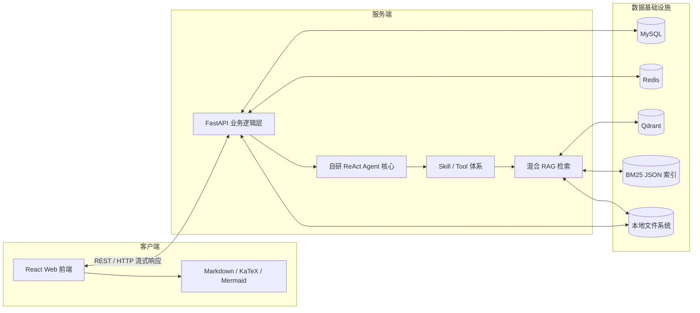
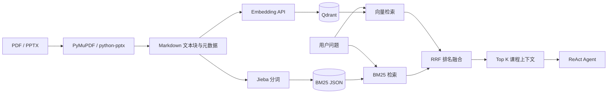
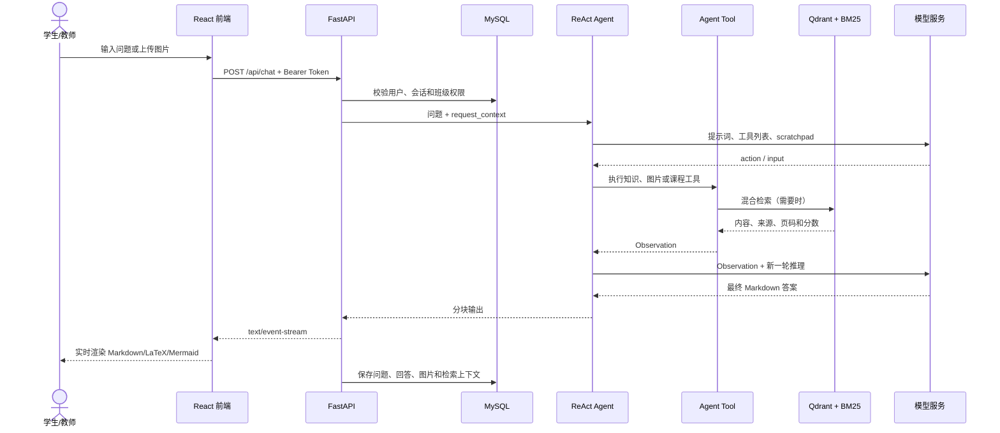

# 离散数学智能助教 Agent 项目技术架构

## 1. 项目概览

本项目是面向离散数学课程的智能助教系统“小离”，同时服务学生与教师。系统不仅提供基于大模型的课程问答，还覆盖班级、课程资料、作业、会话记录和学情分析等教学业务。

核心能力包括：

- 结合课程讲义回答离散数学问题，并标注资料来源和页码。
- 识别题目截图、图论图形和手写内容，并结合课程知识继续推理。
- 支持学生和教师两种角色以及对应的权限边界。
- 管理班级、课程资料、作业发布和学生提交。
- 保存多轮会话、检索上下文以及用户对回答的反馈。
- 根据学生对话生成个人学情报告，并汇总班级学情反馈。
- 课程知识库未命中时，使用大模型的通用离散数学知识补充回答。

系统采用“Web 前端—业务逻辑层—Agent 核心层—数据基础设施”的分层结构。Agent 核心通过 Git Submodule 独立维护，业务后端只通过工具绑定和调用接口使用 Agent 能力。

## 2. 总体架构

### 2.1 框架层次与技术栈

| 架构层 | 主要技术 | 核心职责 |
|---|---|---|
| Web 前端 | React 19、Vite 8、原生 Fetch API | 页面交互、身份选择、聊天、班级、作业和学情展示 |
| 内容渲染 | React Markdown、KaTeX、Mermaid、GFM | 渲染 Markdown、数学公式以及离散数学图形 |
| 业务逻辑层 | Python 3.10、FastAPI、Uvicorn、Pydantic | REST API、权限校验、文件上传、业务编排和流式响应 |
| Agent 核心层 | OpenAI Python SDK、自研 ReAct Agent、Skill/Tool 体系 | 大模型推理、工具选择、知识检索和图片理解 |
| RAG 检索层 | Qdrant、OpenAI 兼容 Embedding API、BM25、Jieba、RRF | 向量检索和关键词检索融合 |
| 关系数据库 | MySQL、SQLAlchemy、mysql-connector-python | 用户、班级、资料、作业、会话和学情数据 |
| 缓存层 | Redis | 邮箱验证码及发送频率控制 |
| 文件存储 | 本地文件系统 | 课程资料、作业附件、聊天图片、检索索引和日志 |
| 鉴权安全 | JWT、python-jose、bcrypt | Bearer Token、密码散列和角色权限控制 |
| 邮件服务 | SMTP、aiosmtplib | 发送学校邮箱注册验证码 |
| 部署 | Docker Compose、Nginx、Node Alpine、Python Slim | 前后端容器化构建和运行 |

## 3. Web 前端

前端是基于 React 的单页应用，使用 Vite 完成开发和生产构建。项目没有引入 Redux、React Router 或大型 UI 组件库，页面状态、身份状态和主要场景切换集中在 [`frontend/src/App.jsx`](frontend/src/App.jsx) 中管理。

### 3.1 主要业务功能

- 注册、登录以及学生/教师身份选择。
- Agent 多轮聊天、历史会话、回答评价和图片上传。
- 教师创建班级、上传课程资料和管理学生。
- 学生通过邀请码加入班级并访问课程资料。
- 教师发布作业，学生提交文字或文件，教师查看提交记录。
- 生成学生个人报告和班级学情反馈。
- 中英文界面以及多种视觉主题。

### 3.2 Agent 内容渲染

模型响应由 [`MarkdownMessage.jsx`](frontend/src/components/MarkdownMessage.jsx) 统一渲染：

- `react-markdown` 渲染 Markdown。
- `remark-gfm` 支持表格、列表等 GitHub 风格 Markdown。
- `remark-math` 与 `rehype-katex` 渲染 LaTeX 数学公式。
- `mermaid` 渲染集合关系、Hasse 图、树、图论结构和流程图。
- 渲染前会兼容处理不同形式的公式定界符和矩阵换行。

### 3.3 前后端通信

前端通过原生 `fetch` 调用 `/api`。JWT 保存在浏览器 `localStorage` 中，并以 `Authorization: Bearer <token>` 发送。普通业务接口使用 JSON；文件接口使用 `FormData`；聊天接口读取响应流并逐块更新页面。

依赖版本和构建脚本见 [`frontend/package.json`](frontend/package.json)。

## 4. 业务逻辑层

业务后端使用 FastAPI 和 Uvicorn，入口为 [`backend/server.py`](backend/server.py)。这一层负责将 Web 请求转换为业务操作或 Agent 请求，并确保用户只能访问其角色和班级权限允许的数据。

主要模块包括：

- 学校邮箱验证码、注册、登录和身份选择。
- 班级创建、加入、成员管理和邀请码机制。
- 课程资料上传、HTML 预览、访问和下载。
- 作业发布、删除、提交以及附件管理。
- 会话创建、消息持久化、历史查询和回答评价。
- 学生学习报告与班级学情反馈生成。
- Agent 请求上下文和工具依赖的组装。
- 聊天图片、课程资料和作业附件的文件权限检查。

Pydantic 模型定义 API 的请求和响应结构，SQLAlchemy Repository 封装关系数据读写，`python-multipart` 负责文件上传解析。

## 5. Agent 核心层

Agent 核心位于 [`backend/agent_core`](backend/agent_core)，并通过 `.gitmodules` 指向独立的 `agent_backend` 仓库 `alpha` 分支。这种结构使 Agent 的推理、工具和 RAG 能力能够脱离 Web 业务独立维护。

### 5.1 自研 ReAct 推理循环

项目没有直接依赖 LangChain，而是在 [`react_agent.py`](backend/agent_core/react_agent.py) 中实现 ReAct 循环：

1. 将用户问题、工具描述和已有 Observation 组装进提示词。
2. 调用 OpenAI 兼容的 Chat Completions 接口。
3. 解析模型返回的 `<thought>`、`<action>`、`<input>` 和 `<answer>` 标签。
4. 如果模型选择工具，则执行工具并将结果追加到 scratchpad。
5. 带着新的 Observation 进入下一轮推理。
6. 生成 `<answer>` 后以小块文本流式返回；单次请求最多推理 5 轮。

聊天模型、Embedding 模型和视觉模型分别通过 API Key、Base URL 和模型名配置，因此可以接入兼容 OpenAI API 规范的不同模型服务。

### 5.2 Skill 与 Tool

Agent 当前主要工具包括：

- `query_course_admin`：查询结构化课程管理信息。
- `query_lecture_knowledge`：检索课程讲义和知识片段。
- `analyze_uploaded_image`：调用视觉模型分析题目图片。
- 学情工具：根据使用场景注入学生报告和班级反馈生成能力。

业务后端通过 [`agent_bindings.py`](backend/app/core/agent_bindings.py) 注入数据库访问、检索器和请求上下文。这样 Agent 只依赖抽象工具，不直接了解 Web 请求和数据库会话的实现细节。

## 6. RAG 知识库

知识库采用稠密向量检索和稀疏关键词检索相结合的混合方案。

### 6.1 入库流程

1. 使用 PyMuPDF 解析 PDF。
2. 使用 python-pptx 解析 PPTX/PPSX。
3. 按页面或幻灯片生成带来源元数据的 Markdown 文本块。
4. 通过 OpenAI 兼容 Embedding API 生成 1536 维向量。
5. 将向量、正文、文件名、资料类型和页码写入 Qdrant。
6. 使用 Jieba 对文本分词，同时构建 BM25 索引并保存为 JSON。

### 6.2 查询流程

1. 将用户问题发送给 Embedding 服务，查询 Qdrant 获取向量相似结果。
2. 使用同一问题查询 BM25 索引，获取关键词相关结果。
3. 使用 RRF（Reciprocal Rank Fusion）融合两组排名。
4. 选取 Top K 片段，将正文、文件名、页码和检索分数返回给 Agent。
5. Agent 优先根据命中的课程资料回答，并在最终内容中标注真实来源。

`requirements.txt` 中仍保留 ChromaDB，但当前代码的实际主向量存储为 Qdrant；BM25 索引保存在本地 JSON 文件。

## 7. 数据与持久化

### 7.1 MySQL

MySQL 是主要业务数据库，通过 SQLAlchemy 访问，核心数据模型包括：

- 用户与学生/教师角色。
- 班级、教师归属和班级成员。
- 班级课程资料。
- 作业、附件和学生提交。
- 会话与聊天消息。
- 消息检索上下文和用户反馈。
- 学生学习报告与班级学情反馈。

数据模型定义见 [`backend/database/mysql_db.py`](backend/database/mysql_db.py)。

### 7.2 Qdrant、Redis 与文件系统

- Qdrant 保存课程资料向量和来源元数据。当前配置默认使用本地嵌入式存储，也支持连接独立 Qdrant 服务。
- Redis 保存邮箱验证码和发送冷却状态，不承担长期业务数据存储。验证码默认 5 分钟过期，发送冷却默认 60 秒。
- 本地文件系统保存课程资料、聊天图片、作业附件、Markdown 中间产物、BM25 索引和应用日志。

## 8. 一次聊天请求的完整数据流

需要注意，聊天接口的媒体类型设置为 `text/event-stream`，前端按原始响应字节流读取；当前实现并未使用标准 SSE 的 `data:` 事件封装。

## 9. 对外接口与权限边界

API 统一使用 `/api` 前缀：

| 路由组 | 主要职责 |
|---|---|
| `/auth` | 验证码、注册、登录、身份选择和当前用户信息 |
| `/classes` | 班级创建/加入、成员和课程资料管理 |
| `/conversations` | 历史会话、消息、删除和回答反馈 |
| `/learning` | 学生报告、个人报告和班级学情反馈 |
| `/homework` | 作业发布、提交、附件和提交记录 |
| `/chat` | Agent 流式聊天、欢迎消息和图片访问 |

权限模型分为 `student` 和 `teacher`：

- 教师可以创建班级、管理学生和课程资料、发布作业、查看提交并生成班级反馈。
- 学生可以加入班级、访问所在班级资料、与 Agent 对话、提交作业并生成个人报告。
- 文件下载、聊天图片和会话访问都会校验用户身份、资源归属或班级访问权。

## 10. 部署结构

项目通过 Docker Compose 编排前端和后端：

- 前端使用 Node 20 Alpine 构建 Vite 静态资源，再由 Nginx Stable Alpine 提供服务，对外端口为 80。
- 后端使用 Python 3.10 Slim 安装依赖并运行 `server.py`，对外端口为 8000。
- 后端数据目录通过 volume 持久化。
- MySQL 和 Redis 当前不在 Compose 文件中，需要由宿主机或外部服务提供。
- Qdrant 默认使用后端本地目录，不需要单独启动 Qdrant 容器。

部署定义见 [`docker-compose.yml`](docker-compose.yml)、[`frontend/Dockerfile`](frontend/Dockerfile) 和 [`backend/Dockerfile`](backend/Dockerfile)。

## 11. 架构优势

- Agent 核心与业务系统解耦，工具和技能可以独立扩展。
- 不依赖重型 Agent 框架，自研 ReAct 流程的行为和输出格式更可控。
- Qdrant 向量检索、BM25 关键词检索与 RRF 融合兼顾语义和专业术语匹配。
- 模型使用 OpenAI 兼容协议，便于替换聊天、Embedding 和视觉服务。
- 前端原生支持 Markdown、LaTeX 和 Mermaid，适合离散数学教学内容。
- 教学问答、班级、资料、作业、会话和学情分析形成相对完整的业务闭环。

## 12. 当前注意事项

- `docker-compose.yml` 只编排前端和后端，MySQL 与 Redis 需要外部提供。
- 后端多数依赖没有锁定精确版本，部署可重复性仍需增强。
- 配置类包含开发用默认数据库口令和 JWT 密钥；生产环境必须完全改用环境变量，并轮换已暴露的默认值。
- CORS 当前允许所有来源；生产环境应限制为实际可信域名。
- 前端主要功能集中在体积较大的 `App.jsx`，后续适合按业务场景拆分组件和状态逻辑。
- 仓库当前没有正式的自动化测试目录，质量保障主要依赖脚本和人工联调。
- ChromaDB、`aioredis` 等依赖与当前实现存在历史遗留或重复，后续应根据引用情况清理。
- Qdrant Embedding 失败时会返回固定 1536 维零向量作为兜底，这可能隐藏上游服务故障并降低检索质量。
- Agent 的 XML 标签解析基于字符串查找，模型输出格式偏离约定时可能触发降级回答。

## 13. 推荐演示与验收场景

- 学生注册登录、选择身份并通过邀请码加入班级。
- 教师上传 PDF/PPTX 讲义，学生询问其中的离散数学知识点。
- 验证回答是否包含正确的资料文件名和页码。
- 上传图论题目截图，验证视觉工具与知识检索的组合调用。
- 连续进行多轮聊天，验证历史会话和检索上下文持久化。
- 教师发布带附件作业，学生提交文件，教师查看提交情况。
- 根据学生对话生成个人学情报告，再汇总为班级学情反馈。
- 验证学生不能访问其他用户图片、其他班级资料或教师管理接口。
- 模拟聊天模型、Embedding、Redis或MySQL不可用，检查错误提示、降级行为和日志。

## 14. 总结

这是一个以 React 和 FastAPI 为 Web 基础、以自研 ReAct Agent 为智能核心、以 Qdrant + BM25 混合 RAG 为课程知识引擎、以 MySQL + Redis + 文件系统为数据底座的离散数学智能助教平台；它不仅能回答问题，还覆盖班级、资料、作业、会话和学情分析等完整教学流程。