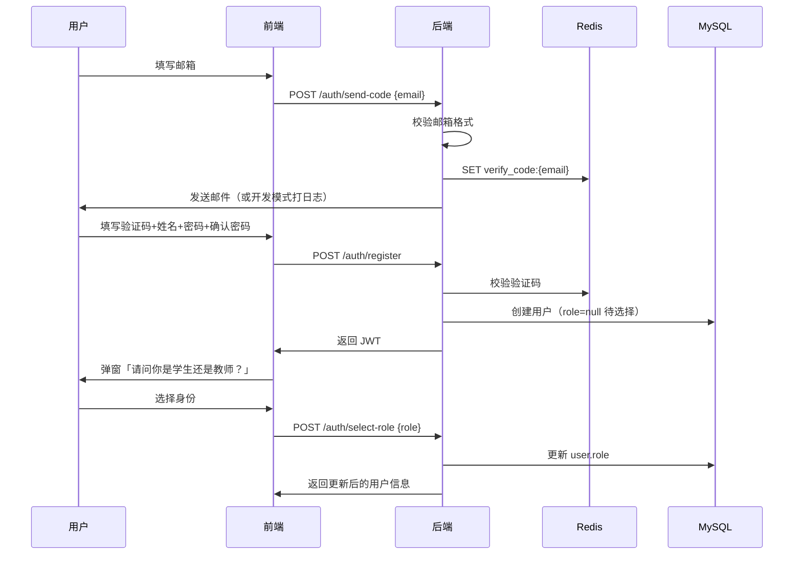
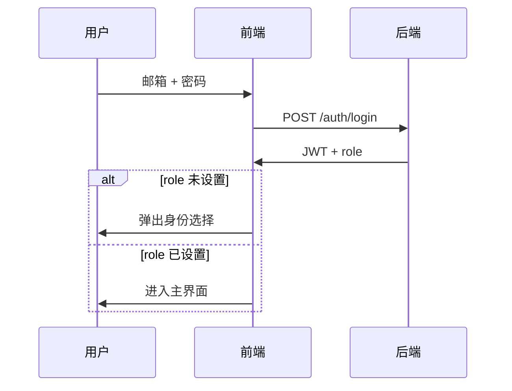

# 离散数学助教系统 — 鉴权与班级体系设计文档

## 1. 目标

构建完整的 Web 端鉴权与权限体系，区分**学生端**与**教师端**，以同济大学学校邮箱为身份入口，以**班级**为学习资料的隔离与共享单元。

---

## 2. 用户角色与权限

| 能力 | 学生 | 教师 |
|------|------|------|
| 学校邮箱注册/登录 | ✅ | ✅ |
| 使用 AI 助教聊天 | ✅ | ✅ |
| 注册后选择身份 | ✅ | ✅ |
| 创建班级 | ❌ | ✅（可多个） |
| 加入班级 | ✅ | ❌（创建者自动归属） |
| 上传班级学习资料 | ❌ | ✅（仅自己创建的班级） |
| 查看班级学习资料 | ✅（已加入的班级） | ✅（自己创建的班级） |
| 触发 RAG 入库 | ❌ | ✅（上传时自动入库到全局知识库，资料元数据按班级存储） |

---

## 3. 邮箱规范

- **格式**：`^[0-9]{7}@tongji\.edu\.cn$`
- **示例**：`2131445@tongji.edu.cn`
- **校验时机**：发送验证码前、注册提交时双重校验

---

## 4. 注册与登录流程

### 4.1 注册流程

### 4.2 登录流程

### 4.3 前端状态

- `access_token` 存 `localStorage`
- `user` 对象：`{ email, name, role }`
- 所有受保护 API 携带 `Authorization: Bearer <token>`

---

## 5. 班级体系

### 5.1 核心概念

- **班级 (Class)**：教师创建的教学单元，含名称、邀请码、创建者。
- **班级成员 (ClassMember)**：学生通过邀请码加入班级。
- **班级资料 (ClassMaterial)**：绑定到班级的文件元数据，物理文件存 `storage/raw/classes/{class_id}/`。

### 5.2 教师流程

1. 登录且 `role=teacher`
2. 创建班级 → 获得 **6 位邀请码**
3. 在主界面**下滑资源页**选择班级 → 上传 PDF/PPTX
4. 上传成功后：文件落盘 + 写入 `class_materials` + 可选触发 RAG 入库

### 5.3 学生流程

1. 登录且 `role=student`
2. 输入邀请码加入班级
3. 下滑资源页仅展示**已加入班级**的资料列表

---

## 6. 数据库设计（MySQL / Discrete）

### 6.1 users（扩展）

| 字段 | 类型 | 说明 |
|------|------|------|
| id | INT PK | |
| email | VARCHAR(255) UNIQUE | 学校邮箱 |
| name | VARCHAR(100) | 显示名称 |
| hashed_password | VARCHAR(255) | bcrypt |
| role | ENUM('student','teacher') NULL | 注册后待选择可为 NULL |
| created_at | DATETIME | |

### 6.2 classes

| 字段 | 类型 | 说明 |
|------|------|------|
| id | INT PK | |
| name | VARCHAR(200) | 班级名称 |
| invite_code | VARCHAR(8) UNIQUE | 邀请码 |
| teacher_id | INT FK → users.id | 创建教师 |
| created_at | DATETIME | |

### 6.3 class_members

| 字段 | 类型 | 说明 |
|------|------|------|
| id | INT PK | |
| class_id | INT FK | |
| student_id | INT FK → users.id | |
| joined_at | DATETIME | |
| UNIQUE(class_id, student_id) | | |

### 6.4 class_materials

| 字段 | 类型 | 说明 |
|------|------|------|
| id | INT PK | |
| class_id | INT FK | |
| filename | VARCHAR(255) | 原始文件名 |
| file_path | VARCHAR(500) | 存储路径 |
| file_type | VARCHAR(20) | pdf / pptx |
| file_size | INT | 字节 |
| uploaded_by | INT FK → users.id | |
| uploaded_at | DATETIME | |

### 6.5 course_info（保留）

原有 SQLite 行政问答数据，已迁移至 MySQL，供 Agent 行政工具使用，与班级体系独立。

---

## 7. API 设计

### 7.1 鉴权 `/api/auth`

| 方法 | 路径 | 说明 |
|------|------|------|
| POST | `/send-code` | 发送邮箱验证码 |
| POST | `/register` | 注册（含验证码、姓名、密码） |
| POST | `/login` | 登录 |
| POST | `/select-role` | 选择学生/教师（需登录） |
| GET | `/me` | 获取当前用户信息 |

### 7.2 班级 `/api/classes`

| 方法 | 路径 | 权限 | 说明 |
|------|------|------|------|
| POST | `/` | 教师 | 创建班级 |
| GET | `/mine` | 登录用户 | 教师：我创建的；学生：我加入的 |
| POST | `/join` | 学生 | 通过邀请码加入 |
| GET | `/{id}/materials` | 班级成员/教师 | 资料列表 |
| POST | `/{id}/materials` | 班级教师 | 上传资料 |

---

## 8. 前端页面改造

### 8.1 注册表单字段

- 学校邮箱（带格式提示）
- 验证码 + 「获取验证码」按钮（60s 冷却）
- 姓名
- 密码
- 确认密码

### 8.2 身份选择弹窗

注册成功或登录发现 `role=null` 时展示，不可跳过。

### 8.3 下滑资源页

- **教师**：班级选择器 + 上传按钮 + 资料卡片列表
- **学生**：已加入班级 Tab + 资料只读列表

---

## 9. 实施步骤（任务拆解）

### Phase 1 — 数据层
- [ ] 扩展 `users` 表（name, role 可空）
- [ ] 新增 `classes` / `class_members` / `class_materials` 表
- [ ] 邮箱格式校验工具函数

### Phase 2 — 鉴权 API
- [ ] 重构 `send-code`：校验同济邮箱
- [ ] 重构 `register`：验证码 + 姓名 + 密码确认
- [ ] 新增 `select-role`、`/me`
- [ ] 登录返回 `role`（可为 null）

### Phase 3 — 班级 API
- [ ] 教师创建班级、生成邀请码
- [ ] 学生加入班级
- [ ] 班级资料上传/列表（按权限过滤）

### Phase 4 — 前端鉴权
- [ ] `httpClient` 自动附带 Token
- [ ] 注册/登录表单对接
- [ ] 身份选择弹窗
- [ ] 登录态持久化

### Phase 5 — 前端班级与资源
- [ ] 教师：班级管理 UI
- [ ] 学生：加入班级 UI
- [ ] 下滑页资料区对接真实 API

### Phase 6 — 联调与测试
- [ ] 端到端注册→选角色→建班/加班→上传→查看
- [ ] 权限边界测试

---

## 10. 安全考量

- 密码 bcrypt 存储，最小长度 8 位
- 验证码 5 分钟过期，验证成功后立即删除
- JWT 有效期 24h（可配置）
- 班级资料访问必须校验成员关系
- 仅允许 `.pdf` / `.pptx` / `.ppsx` 上传

---

## 11. 开发环境说明

- **MySQL**：`Discrete` 库，启动后自动建表
- **Redis**：Docker `redis:6379`，存验证码
- **SMTP 未配置时**：验证码输出到后端日志，便于本地调试
